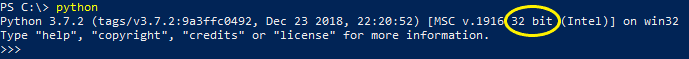

.. _installation:

============
Installation
============

python-geosupport
=================

You can install `python-geosupport` using pip:

``$ pip install python-geosupport``

Or clone this repository, `cd` into it and:

``$ python setup.py install``

Geosupport Desktop Edition
==========================

`python-geosupport` requires a local installation of `Geosupport Desktop Edition`_ (19b):

- `Geosupport Desktop Edition for Windows (32-bit)`_
- `Geosupport Desktop Edition for Windows (64-bit)`_
- `Geosupport Desktop Edition for Linux`_

Geosupport Desktop is not available for Mac but it can be used through a containerized environment like Docker. See the :ref:`related` section for more information.

.. _Geosupport Desktop Edition: https://www1.nyc.gov/site/planning/data-maps/open-data/dwn-gde-home.page
.. _Geosupport Desktop Edition for Windows (32-bit): http://www1.nyc.gov/assets/planning/download/zip/data-maps/open-data/gde_19b.zip
.. _Geosupport Desktop Edition for Windows (64-bit): https://www1.nyc.gov/assets/planning/download/zip/data-maps/open-data/gde_19b_x64.zip
.. _Geosupport Desktop Edition for Linux: https://www1.nyc.gov/assets/planning/download/zip/data-maps/open-data/gde_19b.zip

-------
Windows
-------

**Important:** Ensure you select the correct Geosupport installation that corresponds to the Python interpreter you are using. Ex., Python 32-bit will only work with Geosupport 32-bit.

You can determine if you are running a 32-bit or 64-bit python interpreter by opening the command prompt or powershell and typing `python`. You should see something like this:

~~~~~~~~~~~~~~~~~~~~~~~
Environmental Variables
~~~~~~~~~~~~~~~~~~~~~~~

By default, a clean installation of Geosupport Desktop Edition will set the appropriate environmental variables. If you are experiencing issues setting up your environment, you will want to ensure the following environmental variables are set.

- **GEOFILES**: Path to the *fls* directory of Geosupport. Example: ``C:\Program Files (x86)\Geosupport Desktop Edition\fls\``

- **PATH**: Add the *bin* directory of Geosupport to the *path* variable. Example: ``C:\Program Files (x86)\Geosupport Desktop Edition\bin``

Alternatively see the :ref:`configuration` section for other (easier) options on specifying a path to the Geosupport directory.

-----
Linux
-----
Extract the .zip to a folder of your choice and set the ``GEOFILES`` and ``LD_LIBRARY_PATH`` environmental variables of the fls and lib directories:

.. code-block:: sh

    export GEOFILES=/var/geosupport/version-19b/fls/
    export LD_LIBRARY_PATH=$LD_LIBRARY_PATH:/var/geosupport/version-19b/lib/
